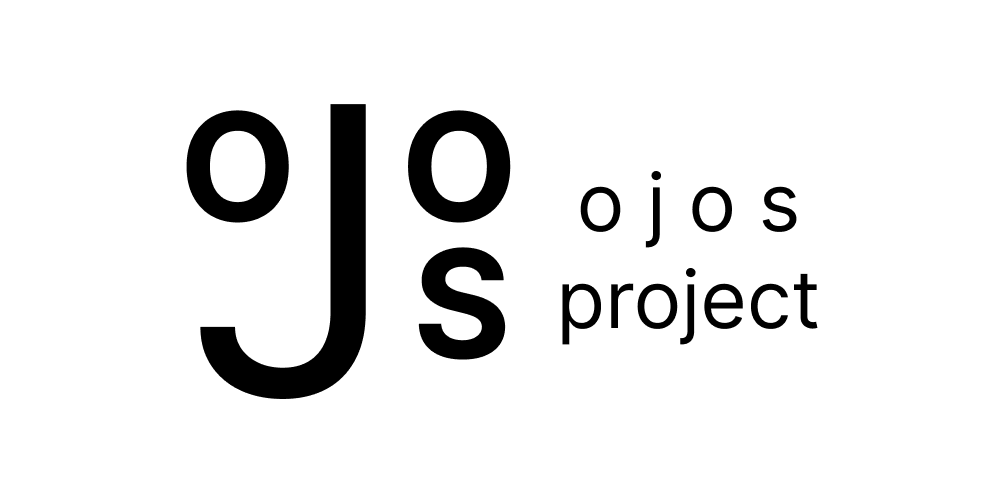

# Discord Bot



This Discord bot is for the Ojos Project to organize ourselves.

## Developer Guide

Install the project dependencies by using this command:

```shell
pip install -r requirements.txt
```

Then, get a Discord token from the
[developer portal](https://discord.com/developers). With that token, run this
command:

```shell
echo 'DISCORD_TOKEN="<DISCORD TOKEN FROM WEBSITE>"' >> .env
echo 'GPG_PASSPHRASE="<PRIVATE PGP KEY>"' >> .env
```

Finally, you can run this bot by running the
[VS Code debugger](https://code.visualstudio.com/Docs/editor/debugging).

### Running Tests

We use `pytest` and `coverage` to test this module. To properly test it, use:

```shell
coverage run -m pytest; coverage xml
```

This creates two files: `.coverage` and `coverage.xml`. Use the
[Coverage Gutters](https://marketplace.visualstudio.com/items?itemName=ryanluker.vscode-coverage-gutters)
extension to see if the tests ran, and the coverage it's covered. Read more with
the Coverage Gutters documentation.
