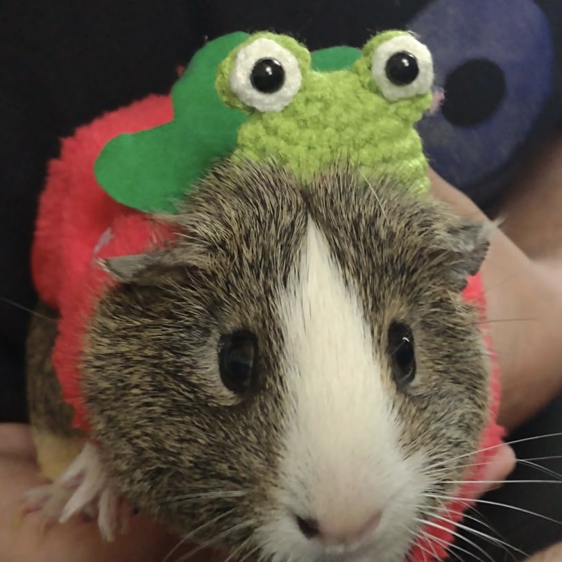

# ChaluBot

The ChaluBot Discord bot is designed to help calejvaldez with various tasks across different Discord servers.

## Tasks? Like what?

Reminders, referencing important documents, making Spotify playlists, etc. Things that I don't personally want to stay on top of. c:

## Why the public repo?

In case people think ChaluBot is tracking more info than necessary. No, it doesn't keep your messages. No, it doesn't spy on you. No, it isn't gonna take over the world. It's made to do stuff I'm too lazy to keep track of. ChaluBot is actually in love with you.

## So, what can it do?

ChaluBot is multi-purpose, so it depends on what features your server has active. Here's a rundown of the features and any data it may track:

### Spotify embeds

Sends messages to a server-specific channel of the music members are listening to.

Data tracked:
|Data|Was already public|Description|
|---|---|---|
|Discord User IDs|Yes|ChaluBot will eventually make playlists for server members. This makes sure your music will go to your playlist.|
|Spotify Track IDs|Yes|Tracks the songs you listen to for the upcoming playlists feature.|
|Timestamp|Yes|The date+time of when ChaluBot first noticed you listened to this song. Ensures the playlist will stay in chronological order.|

### `/purge`

Deletes up to 50 messages at a time.

Data tracked:

None

## Chalupa

Inspired by my college roommate's pet, Chalupa!

