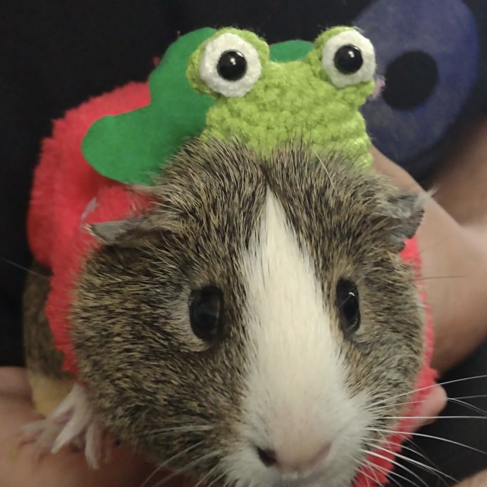

# ChaluBot

The ChaluBot Discord bot is designed to help calejvaldez with various tasks across different Discord servers.

## Tasks? Like what?

Reminders, referencing important documents, making Spotify playlists, etc. Things that I don't personally want to stay on top of. c:

## Why the public repo?

In case people think ChaluBot is tracking more info than necessary. No, it doesn't keep your messages. No, it doesn't spy on you. No, it isn't gonna take over the world. It's made to do stuff I'm too lazy to keep track of. ChaluBot is actually in love with you.

## When will it be released?

No idea.

Inspired by my college roommate's pet, Chalupa!

